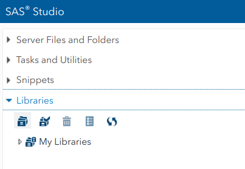
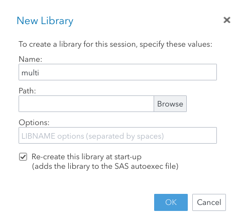

As a first step, please create your account for SAS OnDemand for Academics. To register, visit https://odamid.oda.sas.com and click on Register for an account.

After you have successfully created your account, follow these steps:

- Sign on the the Control Center at https://odamid.oda.sas.com.
- Look for the *Enroll in a course* link in the "*Enrollments*" section near the bottom of the page. Click this link to start the enrollment.
- Enter the course code: `de87d662-6994-481b-9a3d-d50434654171`.
- Submit the form.
- Confirm that this is the correct course and then click the button to finish enrolling.

To automatically load the course data library (with read-only access) upon startup, paste the following line in your **SAS** autoexec script: `LIBNAME statmod "~/my_shared_file_links/u41148888/statmod" access=readonly;`


{width=75%}
{width=75%}


## **SAS** Introduction

To create a library with the introduction data, repeat the previous instruction with the following command:
```{sas loadintro, eval = FALSE}
LIBNAME multi "~/my_shared_file_links/u41148888/multi" access=readonly;
```

You can also [download the `.zip` archive](https://raw.githubusercontent.com/lbelzile/statmod/master/introSAS/Intro_SAS_data.zip) and create the library yourself. To do this, create a repository, upload the databases and use the graphical interface to link the folder to a library:






Once you have the library `multi` set up, you can use the following links to begin the introduction. The video goes over the slides and the code used therein is provided. Once you have been over a section, you can try the exercises (the SAS file contains the solutions with comments, but I urge you to give a try before looking over the answers).

- [Video recording (password: sas)](https://hecmontreal.yuja.com/V/Video?v=87020&node=440156&a=460010524&autoplay=1)
- [Slides](https://raw.githubusercontent.com/lbelzile/statmod/master/introSAS/MATH60619A_SAS_intro.pdf)
- [Code](https://raw.githubusercontent.com/lbelzile/statmod/master/introSAS/MATH60619A_SAS_intro.sas)
- [Exercises](https://raw.githubusercontent.com/lbelzile/statmod/master/introSAS/MATH60619A_SASexercises.pdf)
- [Exercises (**SAS** code)](https://raw.githubusercontent.com/lbelzile/statmod/master/introSAS/MATH60619A_SASexercises.sas)
- [Datasets (zip)](https://raw.githubusercontent.com/lbelzile/statmod/master/introSAS/Intro_SAS_data.zip)


## Installation

We will only use the SAS/BASE and SAS/STAT modules throughout the course. If you have Windows PC, you could also install **SAS** directly. The institutional licence is provided for free, but the IT services at HEC charge users for the download of the software. If you bought the download in the past, you are eligible for free updates. This software may only be used as long as you are a student at HEC Montréal.

